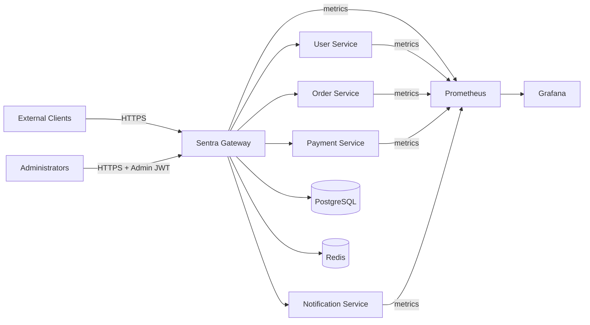
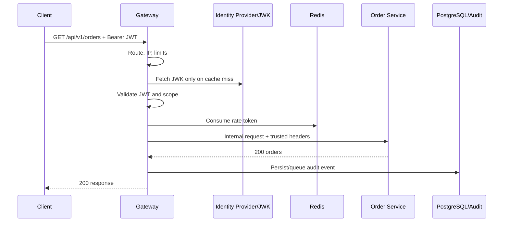
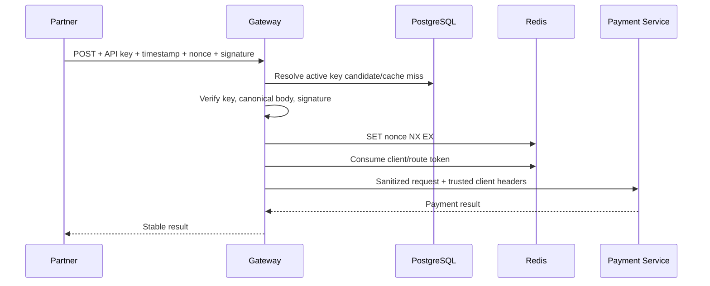
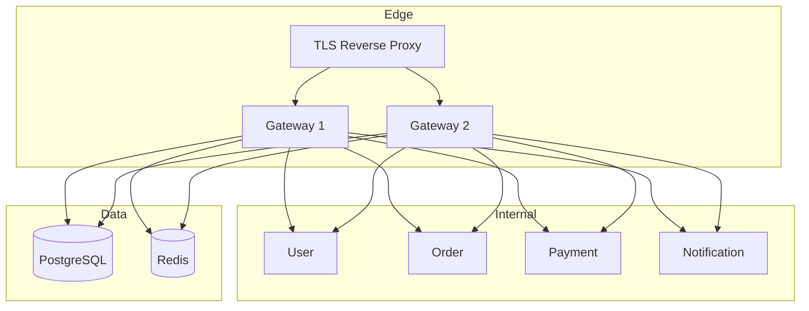

# Sentra Gateway Microservices Documentation

**Version:** 1.0  
**Date:** June 14, 2026  
**Status:** Proposed architecture baseline  
**Companion documents:** [Technical Documentation](Sentra_Gateway_Technical_Documentation.md), [Master TODO](Sentra_Gateway_Master_TODO.md), [SRS](Sentra_Gateway_SRS.md)

> The workspace currently contains no service source code. Names, ports, APIs, schemas, and behavior in this document are the target design and must be reconciled with the implementation as it is created.

## 1. Purpose and Scope

This document defines how Sentra Gateway and its demonstration microservices are separated, secured, deployed, observed, tested, and operated. It covers:

- Sentra Gateway as the only public application entry point.
- User, order, payment, and notification demonstration services.
- PostgreSQL, Redis, Prometheus, and Grafana platform dependencies.
- Synchronous HTTP contracts and internal trusted headers.
- Policy ownership, data ownership, failures, scaling, and service onboarding.

The downstream services intentionally remain small. Their purpose is to prove gateway behavior under different authentication, authorization, signing, rate-limit, and resilience policies.

## 2. Architecture Principles

1. **Single controlled edge:** External clients do not directly address downstream services.
2. **Zero trust at ingress:** Client headers, tokens, keys, signatures, paths, and source-address claims are untrusted.
3. **Deny by default:** Missing or invalid policy produces a rejection for protected routes.
4. **Domain ownership:** A service owns its domain data; the gateway owns edge policy and edge audit data.
5. **Thin filters:** Gateway filters extract context and delegate decisions to testable services.
6. **Bounded synchronous calls:** Every downstream request has an explicit timeout and retry policy.
7. **Observable decisions:** Important requests produce a route result, metric, audit event, and correlated log.
8. **No shared domain database:** Downstream services must not read gateway policy tables.
9. **No credential propagation:** Raw JWTs and API keys are not forwarded unless a reviewed route explicitly requires it.
10. **Versioned contracts:** Public/admin APIs and trusted internal headers have documented compatibility rules.

## 3. System Context



### 3.1 Trust Zones

| Zone | Components | Trust rule |
| --- | --- | --- |
| Public | Browsers, mobile apps, partner clients | All data is untrusted. |
| Edge | Load balancer/reverse proxy, Sentra Gateway | Gateway is the policy enforcement point. |
| Application | User, order, payment, notification services | Accept traffic only from the gateway network identity. |
| Data | PostgreSQL and Redis | Reachable only by authorized platform components. |
| Operations | Prometheus and Grafana | Isolated or authenticated; never publicly exposed by default. |

## 4. Service Catalog

| Service | Logical name | Suggested port | Exposure | Primary responsibility | State |
| --- | --- | ---:| --- | --- | --- |
| Gateway | `gateway-service` | 8080 | Public edge | Routing, security, policy, audit, resilience, admin APIs | PostgreSQL + Redis |
| User | `user-service` | 8081 | Internal | Public/profile and authenticated user examples | In-memory or own DB |
| Order | `order-service` | 8082 | Internal | User order read/create authorization examples | In-memory or own DB |
| Payment | `payment-service` | 8083 | Internal | Partner API key and signed-request examples | In-memory or own DB |
| Notification | `notification-service` | 8084 | Internal | Timeout, retry, fallback, and async-like examples | In-memory or own DB |
| PostgreSQL | `postgres` | 5432 | Data network | Durable routes, policies, clients, keys, audit | Persistent volume |
| Redis | `redis` | 6379 | Data network | Rate counters, nonces, blocks, policy cache | Ephemeral/persistent by profile |
| Prometheus | `prometheus` | 9090 | Operations | Metrics collection and alert rules | Time-series storage |
| Grafana | `grafana` | 3000 | Operations | Dashboards and investigation | Provisioned config |

Ports are defaults for local development, not a promise that host ports will be published.

## 5. Sentra Gateway

### 5.1 Responsibilities

- Match an enabled route deterministically.
- Resolve the client network identity through a trusted-proxy policy.
- Sanitize client-controlled internal headers.
- Authenticate JWT users or API-key clients.
- Validate route roles and scopes.
- Validate required request signatures and reject replayed nonces.
- Enforce IP and risk policies.
- Enforce Redis-backed rate limits.
- Apply body/header limits and route transformations.
- Forward a sanitized request with trusted identity context.
- Apply timeout, retry, circuit-breaker, and fallback policies.
- Return a stable error contract.
- Emit audit, log, metric, and trace evidence.
- Expose protected policy-management APIs.

### 5.2 Non-Responsibilities

- Issuing end-user JWTs.
- Implementing downstream business rules.
- Storing downstream domain data.
- Treating itself as a full identity provider.
- Retrying non-idempotent payment operations automatically.
- Trusting arbitrary `X-Forwarded-*` or `X-Sentra-*` headers.

### 5.3 Internal Modules

| Module | Core interfaces or concepts |
| --- | --- |
| `routing` | Route repository, route validator, dynamic route locator, refresh publisher |
| `security.jwt` | Token decoder, claim mapper, issuer/audience policy |
| `security.apikey` | Client service, key verifier, generator, rotation service |
| `authorization` | Route permission resolver and decision service |
| `security.signing` | Canonicalizer, body hasher, signature verifier, nonce store |
| `security.ip` | Client IP resolver, CIDR matcher, policy evaluator |
| `security.risk` | Signal collector, scoring engine, action resolver |
| `ratelimit` | Policy selector, key resolver, atomic token bucket |
| `resilience` | Timeout, retry, circuit, fallback configuration |
| `audit` | Event factory, redaction, sink, repository, search |
| `observability` | Metrics, traces, health contributors, log context |
| `admin` | Versioned controllers, DTO validation, change audit |

### 5.4 Required Filter Order

The exact framework order values are implementation details, but the semantic order is mandatory:

1. Establish request ID and start timing.
2. Resolve route and normalized request metadata.
3. Resolve trusted client IP.
4. Remove spoofable internal identity headers.
5. Enforce coarse request/header/body limits.
6. Apply IP policy and temporary blocks.
7. Authenticate using the route's accepted mechanism.
8. Authorize roles and scopes.
9. Validate signature, timestamp, body hash, and nonce when required.
10. Evaluate risk signals and action.
11. Enforce rate limit using the authenticated subject when available.
12. Add gateway-controlled trusted headers.
13. Invoke the downstream service through resilience controls.
14. Normalize errors where the gateway owns the failure.
15. Finalize metrics, tracing, logs, and one audit decision.

Tests must prove that a later filter cannot bypass an earlier rejection.

## 6. Downstream Service Specifications

### 6.1 User Service

**Purpose:** Demonstrate public routes, authenticated JWT routes, subject propagation, and safe profile access.

Suggested routes:

| External route | Internal route | Auth | Permission |
| --- | --- | --- | --- |
| `GET /api/v1/public/users/{id}` | `GET /internal/v1/users/{id}/public` | None | Public fields only |
| `GET /api/v1/users/me` | `GET /internal/v1/users/me` | JWT | `profile:read` |
| `PATCH /api/v1/users/me` | `PATCH /internal/v1/users/me` | JWT | `profile:write` |

Rules:

- `/me` uses `X-Sentra-Subject`, not a client-provided user ID.
- The public response excludes email, credentials, internal flags, and security metadata.
- Updates validate content type, body size, and optimistic version.
- The service rejects direct requests that do not carry verified gateway provenance in production-like deployment.

### 6.2 Order Service

**Purpose:** Demonstrate user-specific authorization, route scopes, idempotent reads, and non-idempotent writes.

Suggested routes:

| External route | Internal route | Auth | Permission |
| --- | --- | --- | --- |
| `GET /api/v1/orders` | `GET /internal/v1/orders` | JWT | `orders:read` |
| `GET /api/v1/orders/{id}` | `GET /internal/v1/orders/{id}` | JWT | `orders:read` |
| `POST /api/v1/orders` | `POST /internal/v1/orders` | JWT | `orders:write` |
| `GET /api/v1/admin/orders` | `GET /internal/v1/admin/orders` | JWT | role `ORDER_ADMIN` |

Rules:

- User routes are tenant/subject scoped by trusted headers.
- The service independently prevents access to another user's order.
- `POST` supports an idempotency key if gateway retries are ever enabled.
- Gateway automatic retries remain disabled for create operations by default.

### 6.3 Payment Service

**Purpose:** Demonstrate partner API-key authentication, HMAC request signing, replay protection, strict limits, and high-risk operations.

Suggested routes:

| External route | Internal route | Auth | Signing | Permission |
| --- | --- | --- | --- | --- |
| `GET /api/v1/partner/payments/{id}` | `GET /internal/v1/payments/{id}` | API key | Optional/required by policy | `payments:read` |
| `POST /api/v1/partner/payments` | `POST /internal/v1/payments` | API key | Required | `payments:write` |
| `POST /api/v1/partner/refunds` | `POST /internal/v1/refunds` | API key | Required | `refunds:write` |

Rules:

- The gateway validates the external signature before forwarding.
- The plaintext API key and external signature are removed before forwarding.
- Trusted headers identify client ID, key ID, scopes, request ID, and signature-validation result.
- Create/refund calls are never automatically retried without a verified idempotency contract.
- Rate limits may combine client, route, and IP.
- Every denied or accepted mutation receives a security audit event.

### 6.4 Notification Service

**Purpose:** Demonstrate timeouts, retryable reads, circuit breakers, fallbacks, and controlled degraded behavior.

Suggested routes:

| External route | Internal route | Auth | Resilience |
| --- | --- | --- | --- |
| `GET /api/v1/notifications` | `GET /internal/v1/notifications` | JWT | Short timeout, one bounded retry |
| `POST /api/v1/notifications/preferences` | `POST /internal/v1/preferences` | JWT | No automatic retry |
| `POST /api/v1/admin/test-notification` | `POST /internal/v1/test` | Admin JWT | Circuit breaker, no retry |

Development-only query/header controls may simulate delay or failure, but they must be disabled outside local/test profiles.

## 7. API and Message Conventions

### 7.1 HTTP

- JSON uses UTF-8.
- Admin resources live under `/api/v1/admin`.
- Demonstration public APIs live under `/api/v1`.
- Internal service endpoints live under `/internal/v1`.
- Dates use RFC 3339 UTC timestamps.
- IDs use UUIDs or documented opaque strings.
- Unknown JSON fields are handled according to a single compatibility policy.
- Collection APIs use bounded pagination.
- Mutation APIs return the created/updated representation or an operation result.

### 7.2 Error Contract

```json
{
  "timestamp": "2026-06-14T20:30:00Z",
  "requestId": "01J...",
  "status": 403,
  "code": "GW_SCOPE_REQUIRED",
  "message": "The request is not permitted.",
  "path": "/api/v1/orders",
  "routeId": "orders-list",
  "details": []
}
```

`message` is safe for clients. Detailed internal causes belong in protected logs and audit metadata.

### 7.3 Trusted Headers

Before forwarding, the gateway removes every inbound header in the reserved namespace and creates new values:

| Header | Meaning |
| --- | --- |
| `X-Sentra-Request-Id` | Gateway-approved correlation ID |
| `X-Sentra-Subject` | JWT subject or API client identity |
| `X-Sentra-Actor-Type` | `USER`, `API_CLIENT`, or `SYSTEM` |
| `X-Sentra-Tenant-Id` | Validated tenant, when applicable |
| `X-Sentra-Roles` | Normalized role set |
| `X-Sentra-Scopes` | Normalized scope set |
| `X-Sentra-Client-Id` | API client identifier |
| `X-Sentra-Route-Id` | Selected gateway route |
| `X-Sentra-Source-Ip` | Resolved client IP |
| `X-Sentra-Auth-Time` | Optional validated authentication time |

Header values must be length-bounded and encoded unambiguously. Downstream services must not accept these headers from any network path that bypasses the gateway.

## 8. Request Flows

### 8.1 JWT User Request



### 8.2 Signed Partner Payment



### 8.3 Administrative Route Change

1. Admin JWT is validated and `ROUTE_ADMIN` authority is required.
2. Payload is validated, including target URI and route conflicts.
3. Optimistic version is checked.
4. The database transaction writes the route and admin-action record.
5. A post-commit refresh event invalidates route caches.
6. Each gateway instance loads and validates the new route set.
7. A failed instance retains its last known valid set and raises an alert.

## 9. Security Model

### 9.1 Authentication Matrix

| Route category | Accepted identity | Default signing | Example |
| --- | --- | --- | --- |
| Public | None | No | Public user profile |
| User | JWT | No | User orders |
| Partner | API key | Route-specific, commonly yes | Payments |
| Admin | JWT with admin authority | No | Policy management |
| Internal | Workload identity/network control | Optional | Health or internal callbacks |

### 9.2 Canonical Signed Request

The exact format must be frozen before client implementation. Proposed fields:

```text
HTTP_METHOD
NORMALIZED_PATH
CANONICAL_QUERY
SHA256_HEX(BODY_BYTES)
TIMESTAMP
NONCE
KEY_ID
```

Ambiguous encodings, duplicate headers, stale timestamps, unknown key IDs, body mismatch, and nonce reuse are rejected.

### 9.3 Client IP

- Trust `Forwarded`/`X-Forwarded-For` only when the immediate peer is configured as trusted.
- Select the client address using a documented right-to-left trusted-hop algorithm.
- Canonicalize IPv4 and IPv6 before matching.
- Never use an arbitrary first forwarded value.

### 9.4 Secret Handling

- API keys are shown once and stored as verifiers.
- HMAC secrets are encrypted or held by a secret manager in production.
- Database and Redis credentials are injected.
- Logs redact credentials and sensitive query/header fields.
- Secret rotation has overlap, activation, revocation, and audit steps.

## 10. Data Ownership

### 10.1 PostgreSQL-Owned Gateway Data

`gateway_routes`, `route_permissions`, `api_clients`, `api_keys`, `api_scopes`, `rate_limit_policies`, `ip_rules`, `risk_rules`, `audit_events`, and `admin_action_logs`.

Mutable policies include `created_at`, `updated_at`, `created_by`, `updated_by`, `enabled`, and `version` where applicable.

### 10.2 Redis Key Families

| Pattern | Purpose | Typical TTL |
| --- | --- | --- |
| `sentra:rl:{policy}:{subject}:{route}` | Rate-limit state | Policy window plus buffer |
| `sentra:nonce:{keyId}:{nonceHash}` | Replay prevention | Replay window |
| `sentra:block:{subjectType}:{subject}` | Temporary block | Block duration |
| `sentra:policy:{type}:{id}` | Cached policy | Short bounded TTL |
| `sentra:key:{prefix}` | Cached key metadata/verifier | Short bounded TTL |
| `sentra:route:version` | Route cache generation | No/long TTL |

Raw API keys, full nonces, tokens, and sensitive PII must not appear in key names.

## 11. Failure Policy

| Failure | Default behavior |
| --- | --- |
| Unknown route | `404 GW_ROUTE_NOT_FOUND` |
| Invalid JWT/key | `401` with stable code |
| Missing scope/role | `403` |
| Blocked IP/risk deny | `403` |
| Signature or replay failure | `401` or `403` per frozen contract |
| Rate limit exceeded | `429` plus retry metadata |
| PostgreSQL unavailable | Existing cached routes continue; admin writes fail; key-cache misses deny |
| Redis unavailable | Signed replay-protected routes deny; rate-limit behavior follows explicit route policy |
| JWK endpoint unavailable | Valid cached keys continue until policy limit; uncached validation fails |
| Downstream timeout | `504` or route fallback |
| Downstream unavailable/circuit open | `503` or route fallback |
| Audit sink unavailable | Buffer within strict limits, alert, and follow configured compliance mode |

No component may silently switch from secure enforcement to unrestricted access.

## 12. Resilience Policy

- A route owns its timeout and retry settings.
- Total request budget includes gateway filters and downstream calls.
- Retry only network/transient failures explicitly listed by policy.
- Retry only safe/idempotent methods unless an idempotency contract exists.
- Use exponential backoff, jitter, and a low maximum attempt count.
- Circuit breakers are separated by downstream or route group.
- Fallback content must identify degraded behavior and must not fabricate security-sensitive success.
- Bulkheads protect the event loop, connection pools, and expensive dependencies.

## 13. Observability Standard

### 13.1 Logs

Required fields: timestamp, level, service, environment, request ID, trace ID, route ID, method, normalized route template, status, decision, duration, downstream, and error code.

Forbidden fields: authorization header, cookie, API key, signature, secret, raw token, password, full request body, and sensitive query values.

### 13.2 Metrics

- `sentra_gateway_requests_total`
- `sentra_gateway_request_duration_seconds`
- `sentra_gateway_inflight_requests`
- `sentra_security_decisions_total`
- `sentra_rate_limit_decisions_total`
- `sentra_signature_verification_duration_seconds`
- `sentra_downstream_requests_total`
- `sentra_downstream_request_duration_seconds`
- `sentra_audit_queue_depth`
- Standard JVM, Netty, database pool, and Redis metrics

Labels are limited to route ID, method, status class, decision type, dependency, and environment. User IDs, client keys, request IDs, IPs, and raw paths are prohibited metric labels.

### 13.3 Health

- **Liveness:** process and event loop can operate; it does not fail merely because a dependency is down.
- **Readiness:** instance can safely accept requests under the documented degraded mode.
- **Dependency detail:** protected health endpoint shows PostgreSQL, Redis, route cache, JWK cache, and audit sink state.

## 14. Deployment Topology



Gateway instances are stateless except for local caches. Shared correctness state lives in PostgreSQL and Redis. Session affinity must not be required.

## 15. Configuration

| Variable | Purpose | Required |
| --- | --- | --- |
| `SPRING_PROFILES_ACTIVE` | Runtime profile | Yes |
| `SERVER_PORT` | Gateway port | No |
| `DB_URL`, `DB_USERNAME`, `DB_PASSWORD` | PostgreSQL | Yes |
| `REDIS_HOST`, `REDIS_PORT`, `REDIS_PASSWORD` | Redis | Yes by profile |
| `JWT_ISSUER_URI` | Trusted issuer | Yes for JWT routes |
| `JWT_AUDIENCE` | Required audience | Yes for JWT routes |
| `TRUSTED_PROXY_CIDRS` | Forwarded-header trust | Yes in proxied deployments |
| `AUDIT_RETENTION_DAYS` | Retention | Yes |
| `ROUTE_REFRESH_INTERVAL` | Reconciliation fallback | No |
| `MANAGEMENT_ALLOWED_CIDRS` | Actuator access control | Production-like |

Every variable needs type, default, sensitivity, example, validation, and restart behavior in the environment catalog.

## 16. Testing Strategy

| Level | Scope |
| --- | --- |
| Unit | Canonicalization, CIDR, policy precedence, claims, rate-limit keys, errors |
| Slice | Controllers, repositories, filters, security configuration |
| Integration | PostgreSQL, Redis, JWK server, dynamic routes |
| Contract | Gateway/downstream headers, errors, OpenAPI |
| End-to-end | Client through gateway to each service |
| Security | Spoofing, replay, SSRF, injection, oversized/malformed requests |
| Resilience | Dependency outage, timeout, restart, circuit recovery |
| Performance | Smoke, load, stress, spike, soak |

Each route category needs at least one allow case and one denial for every applicable control.

## 17. Service Onboarding Checklist

- [ ] Assign owner, service name, internal DNS name, health path, and dashboard.
- [ ] Define route IDs, methods, path predicates, rewrite behavior, and target URI.
- [ ] Classify the route as public, user, partner, admin, or internal.
- [ ] Define roles, scopes, signing, IP, risk, and rate-limit policies.
- [ ] Set header/body limits, timeout, retry, circuit, and fallback.
- [ ] Define trusted headers consumed by the service.
- [ ] Confirm the service cannot be publicly reached.
- [ ] Add OpenAPI and gateway/downstream contract tests.
- [ ] Add positive, negative, timeout, and outage scenarios.
- [ ] Add metrics, alerts, runbook, and audit expectations.
- [ ] Complete threat review and data classification.
- [ ] Obtain production approval and rollback plan.

## 18. Operational Runbook Index

Required runbooks:

1. Gateway unavailable or not ready.
2. PostgreSQL unavailable or pool exhausted.
3. Redis unavailable or latency elevated.
4. Identity provider/JWK endpoint unavailable.
5. Downstream timeout/error spike.
6. Circuit breaker remains open.
7. Unexpected authentication or rate-limit denial spike.
8. Audit queue growth or persistence failure.
9. Compromised API key or signing secret.
10. Incorrect dynamic route or security policy.
11. Prometheus scrape failure or Grafana data gap.
12. TLS certificate or secret rotation failure.

## 19. Architecture Decisions Still Required

- Reactive persistence choice: R2DBC versus isolated blocking persistence.
- JWT provider and multi-issuer requirements.
- API-key verifier algorithm and secret-management system.
- Exact signed-request canonicalization specification.
- Redis outage policy per route category.
- Audit durability/compliance mode and acceptable buffering.
- Route refresh distribution mechanism.
- Trace backend and retention.
- Domain persistence for demonstration services.
- Production deployment target beyond Docker Compose.

## 20. Definition of Done for a Microservice

A service is complete only when it builds reproducibly, starts with validated configuration, exposes protected health and metrics, accepts only approved gateway traffic, implements its contract, propagates correlation context, redacts secrets, has unit/integration/contract/security tests, has bounded resource and timeout behavior, appears in dashboards, has alerts and a runbook, and is documented in this catalog.
