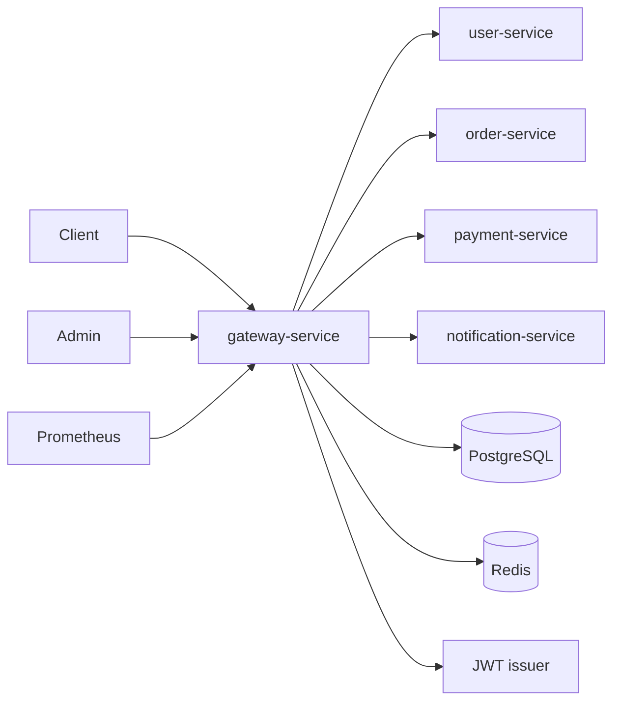

# Gateway Service Documentation

**Version:** 1.0.0  
**Date:** June 15, 2026  
**Status:** Implemented

## Purpose

`gateway-service` is the reactive edge and policy-enforcement service for Sentra.
It owns dynamic route administration, caller authentication, partner API keys,
route authorization, optional request signing, replay defense, route-selected IP,
risk, and rate controls, trusted downstream headers, audit persistence, health,
metrics, and OpenAPI.

It does not issue user JWTs or own user, order, payment, or notification domain
data.

## Architecture



The application uses Spring WebFlux and Spring Cloud Gateway. No blocking
persistence call is made on request threads. Flyway is the only JDBC component and
runs during startup.

## Packages

| Package | Responsibility |
| --- | --- |
| `admin` | Route, client/key, policy, and audit controllers |
| `audit` | Request decision and admin action persistence |
| `authorization` | Runtime route security pipeline |
| `common.error` | Stable error model and exception handlers |
| `common.request` | Correlation ID, source peer, trusted-header sanitation |
| `config` | Type-safe settings, Spring Security, OpenAPI |
| `ratelimit` | Redis atomic token bucket |
| `routing` | Route model, validation, R2DBC repository, route locator |
| `security.apikey` | Issue, verify, rotate, revoke |
| `security.ip` | IPv4/IPv6 CIDR policy evaluation |
| `security.risk` | Deterministic request-shape rules |
| `security.signing` | Canonical HMAC and Redis nonce claims |

Package-level Javadocs are generated under `target/reports/apidocs`.

## Request Lifecycle

For a dynamic route:

1. `RequestContextGlobalFilter` validates or generates a request ID.
2. Reserved trusted headers are removed and `X-Sentra-Request-Id` is created.
3. Spring Cloud Gateway matches an enabled database route.
4. `GatewayPolicyGlobalFilter` evaluates the selected IP rule.
5. The caller is resolved by route category.
6. Roles/scopes are enforced.
7. Signed routes buffer a bounded body and verify timestamp, nonce, and HMAC.
8. The selected risk rule runs.
9. The selected Redis rate policy consumes one token.
10. Credential headers are removed and trusted identity headers are created.
11. Gateway route filters apply prefix removal, safe retry, timeout, and circuit
    breaker behavior.
12. A final request audit event is persisted.

Controller exceptions use `RestExceptionHandler`. Gateway filter failures use
`GlobalErrorHandler`. Both return the same stable `ApiError` shape.

## Route Model

Routes are durable rows in `gateway_routes` and become Spring
`RouteDefinition` objects.

Key fields:

- stable kebab-case ID;
- category;
- path patterns and methods;
- target URI, order, prefix stripping, enabled state;
- authentication types, roles, and scopes;
- signing, IP, risk, and rate policy references;
- connect and response timeout;
- retry and circuit-breaker settings;
- optimistic version and timestamps.

Immediate refresh uses `RefreshRoutesEvent`. The instance generation increments
after successful create, update, enable, disable, or delete.

Validation prevents:

- reserved gateway paths;
- paths without a leading slash;
- dot-segment paths;
- target user information or fragments;
- schemes outside the configured allowlist;
- hosts outside `ROUTE_ALLOWED_SERVICE_HOSTS`;
- unsafe authentication/category combinations;
- signing without API-key authentication;
- retries on non-idempotent methods.

## Route Categories

| Category | Runtime identity |
| --- | --- |
| `PUBLIC` | Anonymous, source-IP subject |
| `USER` | Authenticated Spring Security principal |
| `ADMIN` | Authenticated principal plus route roles/scopes |
| `INTERNAL` | Authenticated principal according to configured route metadata |
| `PARTNER` | `X-API-Key` client |

For authenticated JWT/basic identities, all required roles and all required scopes
must be present. Partner keys must be active, belong to an active client, be
unexpired, match the verifier in constant time, and allow the selected route.

## Trusted Headers

Inbound trusted identity headers are removed before routing. After successful
policy evaluation, the gateway can create:

- `X-Sentra-Request-Id`
- `X-Sentra-Subject`
- `X-Sentra-Actor-Type`
- `X-Sentra-Tenant-Id`
- `X-Sentra-Roles`
- `X-Sentra-Scopes`
- `X-Sentra-Client-Id`
- `X-Sentra-Route-Id`
- `X-Sentra-Source-Ip`

API-key and signing headers are removed before forwarding.

The current source-IP implementation uses the immediate socket peer. Configured
trusted proxy CIDRs are retained for a future forwarded-chain resolver; ingress
must overwrite untrusted forwarding headers and pass the real peer through a
trusted network boundary.

## API-Key Storage

Generated key:

```text
sgw_<environment>_<12 lowercase hexadecimal characters>_<43 base64url characters>
```

PostgreSQL stores:

- public prefix;
- `HMAC-SHA-256(API_KEY_PEPPER, complete plaintext key)` verifier;
- scopes and allowed routes;
- status, validity, rotation parent, last use, and creation time.

The plaintext value is never stored. Metadata DTOs intentionally exclude the
verifier. Rotation first creates a successor, then revokes the predecessor.

## Request Signing

Canonical message:

```text
UPPERCASE_METHOD
NORMALIZED_PATH
CANONICAL_QUERY
SHA256_EXACT_BODY
EPOCH_SECONDS
NONCE
KEY_ID
```

Query pairs are decoded once, RFC 3986 encoded, sorted by encoded name then value,
and duplicates are retained. Signature comparison is constant-time. Content
encoding is rejected for signed requests. Redis `SET NX` semantics enforce nonce
single use.

## IP, Risk, And Rate Controls

Routes reference policy IDs directly.

- IP rules support IPv4/IPv6 exact or CIDR matching, validity, route scope, and
  `ALLOW`, `BLOCK`, or `TEMP_BLOCK`.
- Risk rules measure bounded header count, query parameter count, or path segment
  count.
- Rate limits use Redis server time and an atomic Lua token bucket.

Missing route-selected policy records currently behave as no matching policy.
Security-sensitive deployments should validate references before enabling routes
and treat policy deletion as a reviewed operation.

## Persistence

Flyway migration `V1__create_gateway_schema.sql` creates:

- `gateway_routes`
- `api_clients`
- `api_keys`
- `rate_limit_policies`
- `ip_rules`
- `risk_rules`
- `audit_events`
- `admin_action_logs`

Mutable routes, clients, and policies use optimistic versions. Admin action rows
record successful route and key/client lifecycle operations. Request audits record
time, request ID, route, decision, reason, actor reference, source peer, status,
latency, instance, and environment.

## Security Configuration

Local:

- HTTP Basic;
- `{noop}` passwords from environment variables;
- Swagger public;
- intended only for development.

JWT:

- issuer discovery through `JWT_ISSUER_URI`;
- bearer-token validation by Spring Security;
- `scope`/`scp` to `SCOPE_*`;
- `roles` to `ROLE_*`;
- Swagger restricted to operator/super-admin.

CSRF is disabled because the API is stateless and does not use browser sessions for
authentication.

## Observability

Actuator exposes:

- health;
- info;
- metrics;
- Prometheus.

Spring Cloud Gateway and Resilience4j metrics are enabled. Responses include
`X-Request-Id`. Unexpected controller exceptions are logged server-side with the
request method/path while clients receive a sanitized error.

## Container Design

The `Containerfile`:

1. builds with Maven 3.9.12 and Eclipse Temurin 25;
2. runs `clean verify` inside the build stage;
3. copies only the executable JAR to a Temurin 25 JRE image;
4. installs `curl` for health checks;
5. runs as UID `10001`;
6. supports a read-only root filesystem with `/tmp` tmpfs.

Compose waits for PostgreSQL and Redis health before starting the gateway.

## Verification

Automated tests cover:

- route validation and optimistic CRUD;
- unsafe target rejection;
- administration authentication and operator read-only access;
- Swagger path generation;
- API client/key issue and metadata redaction;
- API-key verification, revocation, and rotation;
- all policy create/update/delete repository paths;
- bounded audit and admin-action reads;
- signing canonicalization, valid signatures, and stale timestamps;
- IPv4/IPv6 CIDR matching;
- text-list persistence codec.

Container verification additionally covers PostgreSQL, Flyway, Redis, readiness,
Swagger, and Newman API execution.

## Current Boundaries

The delivered version is a complete executable baseline for the implemented API.
The following larger platform capabilities are outside this module version and
must not be inferred from configuration names:

- audit export jobs;
- route-permission resources separate from route role/scope fields;
- scheduled last-known-good reconciliation across replicas;
- trusted multi-hop forwarded-IP parsing;
- persistent idempotent response replay;
- temporary-block creation as a separate Redis risk workflow;
- performance/SLO certification and multi-replica chaos evidence.

These are release-roadmap items, not hidden behavior.
