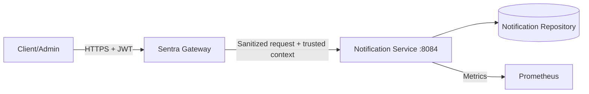

# Notification Service Documentation

**Version:** 1.0.0  
**Date:** June 16, 2026  
**Status:** Final implementation specification; notification-service verified locally  
**Owner:** Sentra Gateway project

## Purpose

`notification-service` is a downstream service used to demonstrate resilience
behavior through controlled reads, preference mutation, and admin-triggered test
notifications. It exists to help prove gateway timeout, retry, circuit-breaker,
fallback, failure classification, metrics, and runbook behavior.

It is not a production notification provider. It does not send real email, SMS,
push notifications, webhooks, or chat messages.

## Source Documents

This specification reconciles:

1. `docs/Technical Implementation/Sentra_Gateway_Microservices_Documentation.md`
2. `docs/Technical Implementation/Sentra_Gateway_SRS.md`
3. `docs/Technical Implementation/Sentra_Gateway_Master_Backlog.md`
4. `docs/Sentra Technical Documentation/Sentra_Gateway_Technical_Documentation.md`

Where sources differ, precedence is:

1. explicit notification-service route and resilience requirements;
2. SRS resilience, service, error, observability, and security requirements;
3. master backlog platform, fault-injection, test, and operations items;
4. generic endpoint examples in the broad technical document.

## Architecture

The gateway owns JWT validation, route policy, retry, timeout, circuit breaker,
fallback selection, and audit decisions. The service owns deterministic
notification state, preference data, controlled fault simulation, and redacted
service telemetry.

## Responsibilities

The service owns:

- deterministic notifications and preferences;
- subject/tenant scoping;
- admin test-notification behavior;
- configurable local/test delay and failure simulation;
- strict request validation;
- stable `NTF_*` service errors;
- health, metrics, logs, and OpenAPI.

The gateway owns:

- external TLS and JWT validation;
- route matching and path rewrite;
- route roles/scopes;
- removal of inbound reserved headers;
- rate limits, risk and IP policy;
- timeout, retry, circuit, and fallback policy;
- gateway audit decisions.

The service does not:

- validate bearer JWTs;
- accept direct public traffic;
- send real notifications;
- implement external provider credentials;
- own gateway fallback responses;
- enable development fault controls in production-like profiles.

## Recommended Modules

| Package | Responsibility |
| --- | --- |
| `config` | typed properties, startup validation, OpenAPI, management exposure |
| `common.request` | request ID, trusted headers, peer/provenance validation |
| `common.error` | stable errors and exception mapping |
| `notification` | notification model, repository, service, validation |
| `preference` | preference model and mutation service |
| `fault` | local/test-only delay, status, malformed, disconnect simulation |
| `web` | controllers and DTOs |
| `observability` | health, metrics, redacted logs |

Implementation should stay consistent with the Java services stack: Java 25,
Spring Boot 4, Spring MVC, Bean Validation, Actuator, Micrometer, and springdoc.

## Request Lifecycle

1. Accept or generate a bounded request ID.
2. Reject oversized headers/bodies early.
3. Verify the socket peer or workload identity is an approved gateway.
4. Reject duplicate security-critical trusted headers.
5. Require exact `X-Sentra-Route-Id`.
6. Require actor type `USER`.
7. Require subject for user routes.
8. Require `notifications:read`, `notifications:write`, or `NOTIFICATION_ADMIN`.
9. Apply local/test-only fault controls if enabled and allowed for the route.
10. Validate query/body.
11. Read or mutate deterministic state.
12. Return documented response and `X-Request-Id`.
13. Emit low-cardinality metrics and redacted logs.

## Route Model

| Route ID | Method | Internal path | Policy | Resilience intent |
| --- | --- | --- | --- | --- |
| `notifications-list` | `GET` | `/internal/v1/notifications` | `USER`, `notifications:read` | short timeout, one bounded retry |
| `notification-preferences-update` | `POST` | `/internal/v1/preferences` | `USER`, `notifications:write` | no automatic retry |
| `admin-test-notification` | `POST` | `/internal/v1/test` | `USER`, `NOTIFICATION_ADMIN` | circuit breaker, no retry |

Exact route IDs are required. A mismatched route identity is rejected.

## Domain Model

### Notification

| Field | Type | Rule |
| --- | --- | --- |
| `id` | UUID | stable deterministic ID |
| `subject` | string | trusted owner, internal only |
| `tenantId` | string/null | trusted tenant, internal only |
| `channel` | enum | `EMAIL`, `SMS`, `PUSH`, `WEBHOOK` |
| `title` | string | 1-120 characters |
| `message` | string | 1-1000 characters |
| `status` | enum | `QUEUED`, `SENT`, `FAILED`, `SUPPRESSED` |
| `createdAt` | instant | RFC 3339 UTC |

User notification responses omit `subject`, `tenantId`, provider details,
credentials, internal retry counters, and gateway security metadata.

### Preferences

| Field | Type | Rule |
| --- | --- | --- |
| `emailEnabled` | boolean | required |
| `smsEnabled` | boolean | required |
| `pushEnabled` | boolean | required |
| `webhookEnabled` | boolean | required |
| `version` | integer | optimistic version |
| `updatedAt` | instant | server-controlled |

Preference mutation is non-idempotent in the baseline because it uses optimistic
versioning. Gateway automatic retry remains disabled.

## Fault Simulation

Fault controls are a deliberate local/test feature:

| Control | Purpose |
| --- | --- |
| delay | exceed or approach route timeout |
| status override | return configured failure status |
| malformed response | simulate downstream protocol failure |
| disconnect | simulate connection drop |

Rules:

- disabled by default;
- enabled only in `local` or `test`;
- never enabled in production-like profiles;
- bounded by maximum delay and allowed status lists;
- never logs bodies, credentials, or sensitive trusted headers;
- always visible through metrics and logs with finite reason labels.

## Resilience Intent

The service supplies deterministic scenarios; the gateway owns the resilience
policy.

| Scenario | Service behavior | Expected gateway behavior |
| --- | --- | --- |
| notification read transient failure | optional local/test failure once | one bounded retry when route policy permits |
| notification read slow response | delay beyond route budget | timeout and fallback/504 per policy |
| preferences mutation slow/failing | no service retry advice | no automatic gateway retry |
| admin test repeated failure | controlled 5xx/timeout | circuit opens, then half-open recovery test |
| malformed response | invalid body when enabled | gateway classifies downstream protocol failure |

Fallback content is gateway-owned. The service must not fabricate success for
mutations.

## Deterministic Data

Local/test profiles should seed:

| ID | Tenant | Subject | Channel | Status | Purpose |
| --- | --- | --- | --- | --- | --- |
| `70000000-0000-4000-8000-000000000001` | `tenant-demo` | `sentra-user-omar` | `EMAIL` | `SENT` | owned read |
| `70000000-0000-4000-8000-000000000002` | `tenant-demo` | `sentra-user-omar` | `PUSH` | `QUEUED` | owned read |
| `80000000-0000-4000-8000-000000000001` | `tenant-demo` | `sentra-user-other` | `SMS` | `SENT` | foreign subject isolation |
| `90000000-0000-4000-8000-000000000001` | `tenant-other` | `sentra-user-omar` | `EMAIL` | `FAILED` | foreign tenant isolation |

Restarting memory mode resets notifications, preferences, and fault counters.

Initial preferences for local/test profiles:

| Tenant | Subject | Email | SMS | Push | Webhook | Version | Purpose |
| --- | --- | --- | --- | --- | --- | ---: | --- |
| `tenant-demo` | `sentra-user-omar` | `true` | `false` | `true` | `false` | 2 | primary Postman update fixture |
| `tenant-demo` | `sentra-user-other` | `true` | `true` | `false` | `false` | 1 | foreign subject isolation |
| `tenant-other` | `sentra-user-omar` | `false` | `false` | `true` | `false` | 1 | foreign tenant isolation |

## Observability

Required metrics:

- `sentra_notification_requests_total{operation,status_class,environment}`
- `sentra_notification_request_duration_seconds{operation,status_class,environment}`
- `sentra_notification_faults_total{operation,fault,result,environment}`
- `sentra_notification_preferences_updates_total{result,environment}`
- `sentra_notification_repository_operations_total{operation,result,environment}`
- standard JVM, process, and HTTP server metrics

Forbidden labels: subject, tenant, notification ID, request ID, IP, raw path,
title, message, body, token, and role/scope values.

Logs include request ID, route ID, operation, status class, finite fault reason,
duration, and result. Logs exclude message bodies, titles, subject, tenant,
authorization headers, cookies, and raw trusted headers.

## Container Design

The implementation must:

1. use a multi-stage build;
2. run as a fixed non-root UID;
3. support a read-only root filesystem;
4. use bounded `/tmp`;
5. expose container port `8084` without base host publication;
6. attach to `sentra-gateway_services`;
7. define a Compose readiness health check;
8. contain no credentials or provider secrets.

## Testing Strategy

Minimum evidence:

- user list success and tenant/subject isolation;
- preference update success, validation, version conflict, and no-retry contract;
- admin test route authorization and controlled fault behavior;
- local/test delay/status/malformed/disconnect scenarios;
- production-like startup rejects fault controls;
- route/actor/scope/role/provenance denials;
- health, metrics, OpenAPI, container, Postman/Newman, and gateway resilience E2E.

## Current Boundaries

Not claimed:

- real email/SMS/push/webhook delivery;
- durable queue/broker;
- retry scheduling inside service;
- provider credentials or templates;
- user device/token management;
- production alert routing;
- workload mTLS;
- performance/SLO certification.
