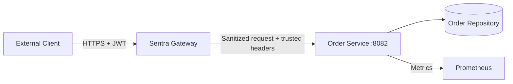

# Order Service Documentation

**Version:** 1.0.0  
**Date:** June 15, 2026  
**Status:** Final implementation specification; implementation not yet verified  
**Owner:** Sentra Gateway project

## Purpose

`order-service` is a small downstream service used to demonstrate that gateway
authentication does not replace domain authorization. The gateway authenticates
the JWT and applies route policy; the service still verifies trusted context and
enforces ownership before reading or creating order data.

The service proves:

- subject-scoped and tenant-scoped collection reads;
- ownership-safe single-order reads;
- scope-protected non-idempotent creation;
- optional request idempotency;
- role-protected administrator reads;
- trusted-header provenance and correlation;
- stable errors, health, metrics, and internal-only deployment.

It is not a complete commerce, inventory, payment, shipping, or fulfillment
system.

## Source Documents

This specification reconciles:

1. `docs/Technical Implementation/Sentra_Gateway_Microservices_Documentation.md`
2. `docs/Technical Implementation/Sentra_Gateway_SRS.md`
3. `docs/Technical Implementation/Sentra_Gateway_Master_TODO.md`
4. `docs/Sentra Technical Documentation/Sentra_Gateway_Technical_Documentation.md`

Where sources differ, the precedence is:

1. explicit order-service requirements in the SRS;
2. explicit order-service routes and rules in the microservices document;
3. security, operations, and delivery requirements in the master TODO;
4. generic examples in the broad technical document.

This resolves the older `/api/orders/**` example to the versioned
`/api/v1/orders` contract.

## Architecture



Trust boundaries:

| Boundary | Rule |
| --- | --- |
| Client to gateway | All input and credentials are untrusted. |
| Gateway to service | Only approved gateway network identities may connect. |
| Trusted headers | Accepted only after provenance and bounded-value checks. |
| Service to repository | Order data is owned exclusively by `order-service`. |
| Management endpoints | Operations network or authentication is required. |

## Responsibilities

The service owns:

- order data and deterministic sample orders;
- order ownership rules;
- subject/tenant filtering;
- order request validation;
- idempotency records for order creation;
- safe order response DTOs;
- service-level errors;
- service health and order-domain metrics.

The gateway owns:

- external TLS termination;
- JWT signature, issuer, audience, expiry, and claim validation;
- external route matching and path rewrite;
- removal of inbound reserved headers;
- route-level scope and role enforcement;
- IP, risk, and Redis-backed rate-limit policy;
- downstream timeout, circuit, and retry policy;
- gateway audit decisions.

The service does not:

- accept direct public traffic;
- parse or validate bearer tokens;
- read gateway policy tables;
- trust arbitrary `X-Sentra-*` headers;
- process payments, inventory, shipment, cancellation, or refunds;
- automatically retry order creation;
- expose owner identity through user-facing order DTOs.

## Recommended Modules

| Package | Responsibility |
| --- | --- |
| `config` | Typed properties, startup validation, OpenAPI, management security |
| `common.request` | Request ID, trusted headers, peer/provenance validation |
| `common.error` | Stable error model and exception mapping |
| `order` | Domain model, repository, service, validation, idempotency |
| `web` | Internal controllers and DTOs |
| `observability` | Metrics, health indicator, bounded structured logging |

Framework choice should remain consistent with the other Java services:
Java 25, Spring Boot 4, Spring MVC, Bean Validation, Actuator, Micrometer, and
springdoc OpenAPI.

## Request Lifecycle

1. Establish or accept the approved request ID.
2. Reject oversized headers/body before domain parsing.
3. Verify the socket peer or workload identity is approved.
4. Read each security-critical trusted header as one unambiguous value.
5. Verify the trusted route ID matches the controller operation.
6. Require actor type `USER`.
7. Require `orders:read`, `orders:write`, or `ORDER_ADMIN`.
8. Resolve subject and tenant context.
9. Validate path, query, media type, and JSON.
10. Apply repository and ownership rules.
11. Return the documented response and `X-Request-Id`.
12. Emit a low-cardinality metric and a redacted structured log.

Any failure before repository access must avoid changing state.

## Route Model

| Route ID | Method | Internal path | Policy |
| --- | --- | --- | --- |
| `orders-list` | `GET` | `/internal/v1/orders` | `USER`, `orders:read` |
| `orders-get` | `GET` | `/internal/v1/orders/{id}` | `USER`, `orders:read` |
| `orders-create` | `POST` | `/internal/v1/orders` | `USER`, `orders:write` |
| `admin-orders-list` | `GET` | `/internal/v1/admin/orders` | `USER`, `ORDER_ADMIN` |

Exact trusted route IDs are required. A request forwarded under the wrong route
identity is rejected even if the actor otherwise has permission.

## Domain Model

### Order

| Field | Type | Rule |
| --- | --- | --- |
| `id` | UUID | Stable, generated by the service, never reused |
| `ownerSubject` | string | Trusted subject captured at creation; internal/admin only |
| `tenantId` | string/null | Trusted tenant captured at creation |
| `items` | ordered list | 1-50 immutable order items |
| `status` | enum | `CREATED`, `PROCESSING`, `COMPLETED`, or `CANCELLED` |
| `createdAt` | instant | RFC 3339 UTC |
| `updatedAt` | instant | RFC 3339 UTC |

The current API creates orders only in `CREATED`. Other states exist so
deterministic historical data can exercise reads. No status-transition endpoint
is included in this scope.

### Order Item

| Field | Type | Rule |
| --- | --- | --- |
| `sku` | string | Trimmed opaque identifier, 1-64 visible characters |
| `quantity` | integer | 1-100 |

Pricing is intentionally absent. The client cannot submit trusted price,
discount, tax, payment, inventory, or fulfillment values.

### Ownership Key

An order belongs to:

```text
(tenantId, ownerSubject)
```

`tenantId` is nullable only for deployments that do not use tenants. If a
trusted tenant header is present, user reads require an exact tenant match. If it
is absent, the caller can access only orders created in the no-tenant partition.
The subject always must match.

## Authorization Rules

### User Collection

The service queries by both trusted tenant and trusted subject. Filtering a
global result in controller code is prohibited because it risks disclosure and
wastes resources.

### User Single Read

The repository lookup must include ownership or the service must perform a
constant-policy ownership comparison before mapping the response.

Unknown, foreign-subject, foreign-tenant, and non-visible orders all return:

```text
404 ORD_ORDER_NOT_FOUND
```

This prevents an attacker from distinguishing valid foreign order IDs.

### Administrator Collection

The admin route requires actor type `USER` and role `ORDER_ADMIN`. It may return
owner and tenant references because the route exists for authorized operational
inspection. It remains bounded and paginated.

## Pagination

Collection endpoints use zero-based page pagination:

| Parameter | Default | Limit |
| --- | ---: | ---: |
| `page` | `0` | maximum `10000` |
| `size` | `20` | `1-100` |

Ordering is fixed to `createdAt DESC, id DESC`. Client-selected arbitrary sort
expressions are not supported. Responses include `page`, `size`,
`totalElements`, `totalPages`, and `items`.

The in-memory implementation computes totals exactly. A future repository may
change pagination only through a backward-compatible contract revision.

## Create Semantics

`POST /internal/v1/orders` creates one order from the trusted owner context and
the submitted item list.

- The request cannot contain `id`, owner, tenant, status, or timestamps.
- Unknown JSON fields are rejected.
- The response is `201 Created`.
- `Location` identifies the internal single-order resource.
- Automatic gateway retries are disabled by default.
- A missing idempotency key is valid, but the caller accepts duplicate risk if
  it independently retries after an ambiguous network failure.

## Idempotency

`Idempotency-Key` is optional for create and strongly recommended.

| Rule | Value |
| --- | --- |
| Encoding | One visible ASCII value |
| Length | 1-128 characters |
| Scope | route + tenant + subject + key |
| Payload comparison | SHA-256 of canonical validated request fields |
| Default retention | 24 hours |
| Same key/same payload | Return the original status, body, and `Location` |
| Same key/different payload | `409 ORD_IDEMPOTENCY_CONFLICT` |
| Concurrent duplicate | Exactly one order is committed |

A replayed response includes:

```text
Idempotency-Replayed: true
```

The original response may return `Idempotency-Replayed: false`. Idempotency keys
and payload fingerprints must not be logged or exposed as metric labels.

The memory repository stores idempotency records with the order atomically under
one synchronization boundary. A future database implementation must provide the
equivalent transaction and uniqueness constraint.

## Deterministic Data

Local/test profiles should seed at least:

| Order ID | Tenant | Subject | Status | Purpose |
| --- | --- | --- | --- | --- |
| `10000000-0000-4000-8000-000000000001` | `tenant-demo` | `sentra-user-omar` | `COMPLETED` | Owned historical order |
| `10000000-0000-4000-8000-000000000002` | `tenant-demo` | `sentra-user-omar` | `CREATED` | Owned current order |
| `20000000-0000-4000-8000-000000000001` | `tenant-demo` | `sentra-user-other` | `PROCESSING` | Foreign-subject denial |
| `30000000-0000-4000-8000-000000000001` | `tenant-other` | `sentra-user-omar` | `COMPLETED` | Foreign-tenant denial |

Seed timestamps and item values must also be fixed. Restarting the memory mode
must reset the same dataset.

## Error Handling

Errors use the shared Sentra shape:

```json
{
  "timestamp": "2026-06-15T12:00:00Z",
  "requestId": "8e3a95b8-6674-423e-83e6-0df84c2d66d0",
  "status": 403,
  "code": "ORD_SCOPE_REQUIRED",
  "message": "The required order permission is missing.",
  "path": "/internal/v1/orders",
  "routeId": "orders-list",
  "details": []
}
```

Messages are client-safe. Details are bounded and never echo complete submitted
items, subjects, tenants, tokens, idempotency keys, or internal exceptions.

## Observability

Required logs:

- timestamp, level, service, environment, request ID, trace ID when available;
- route ID, operation, method, normalized route template;
- status class, duration, result code, and replay boolean;
- no raw subject, tenant, order ID, SKU list, payload, or idempotency key by
  default.

Required service metrics:

- `sentra_order_requests_total{operation,status_class,environment}`
- `sentra_order_request_duration_seconds{operation,status_class,environment}`
- `sentra_order_creations_total{result,environment}`
- `sentra_order_idempotency_total{result,environment}`
- `sentra_order_repository_operations_total{operation,result,environment}`
- standard JVM, process, and HTTP server metrics

Allowed `result` values are finite enums such as `created`, `replayed`,
`conflict`, `not_found`, and `denied`. Subjects, tenants, order IDs, request IDs,
SKUs, raw paths, and idempotency keys are forbidden labels.

## Health

- Liveness reports whether the process can operate.
- Readiness reports whether the configured repository can safely serve requests.
- A memory repository is ready after deterministic initialization.
- A future external repository must use bounded health timeouts.
- Management details are never publicly exposed.

## Container Design

The implementation must:

1. use a multi-stage build;
2. run as a fixed non-root UID;
3. support a read-only root filesystem;
4. use `/tmp` only through a bounded temporary filesystem;
5. expose container port `8082` without publishing it in base deployment;
6. attach to the gateway internal services network;
7. provide a Compose health check;
8. contain no credentials or environment-specific secrets.

A separate local-only override may bind `127.0.0.1:8082` for Postman. If Podman
uses only internal networks, that override must also attach a non-internal local
test network so host port forwarding works.

## Testing Strategy

Minimum automated evidence:

- exact ownership filtering for list and single read;
- foreign subject and foreign tenant both return indistinguishable `404`;
- actor, scope, role, route ID, duplicate-header, and provenance denials;
- pagination defaults, limits, ordering, and invalid parameters;
- strict JSON, media type, field constraints, and body limit;
- successful creation and immutable server-controlled fields;
- idempotent replay, payload conflict, expiry, and concurrent duplicate;
- stable errors and request-ID correlation;
- health, Prometheus, and OpenAPI assertions;
- base Compose internal exposure and hardened container inspection;
- gateway/downstream header and route compatibility;
- client-through-gateway JWT allow and deny scenarios.

## Current Boundaries

The following are intentionally not claimed:

- durable production database;
- multi-instance write consistency in memory mode;
- inventory reservation;
- pricing or currency calculation;
- payment processing;
- order updates, cancellation, or fulfillment workflows;
- customer notifications;
- event streaming;
- workload mTLS;
- production SLO certification.

These require separate approved requirements and are not placeholders in the
current order-service scope.
