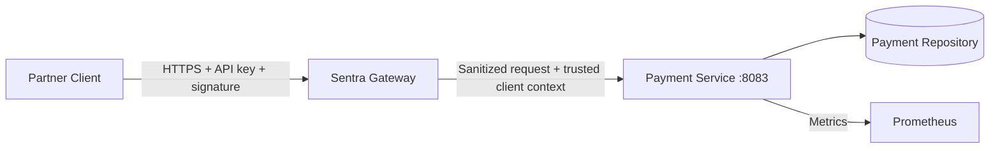

# Payment Service Documentation

**Version:** 1.0.0  
**Date:** June 16, 2026  
**Status:** Implemented baseline service specification; gateway E2E verification remains external  
**Owner:** Sentra Gateway project

## Purpose

`payment-service` is a downstream service used to demonstrate partner API-key
authentication, HMAC request-signature enforcement, replay-protection evidence,
strict input limits, high-risk mutation handling, and safe gateway-to-service
contracts.

It is deliberately small. It is not a complete payment processor and it does not
connect to a real bank, card network, wallet, ledger, settlement system, or
refund processor.

## Source Documents

This specification reconciles:

1. `docs/Technical Implementation/Sentra_Gateway_Microservices_Documentation.md`
2. `docs/Technical Implementation/Sentra_Gateway_SRS.md`
3. Sentra Gateway master security and delivery backlog
4. `docs/Sentra Technical Documentation/Sentra_Gateway_Technical_Documentation.md`

Where sources differ, precedence is:

1. explicit payment-service route and signing requirements;
2. SRS API-key, signing, replay, resilience, error, and service requirements;
3. master security, test, observability, and operations backlog;
4. generic examples in the broad technical document.

This resolves the older `/api/payments/**` example to the versioned
`/api/v1/partner/payments` and `/api/v1/partner/refunds` contract.

## Architecture

The gateway owns external security decisions. The service owns domain state and
must still verify that gateway-created context is present, bounded, consistent,
and allowed for the requested internal operation.

## Responsibilities

The service owns:

- deterministic payment and refund records;
- partner/client ownership checks;
- payment and refund request validation;
- idempotency records for create/refund mutations;
- trusted-context enforcement after gateway authentication;
- safe domain DTOs;
- service-owned stable errors;
- health, metrics, redacted logs, and OpenAPI.

The gateway owns:

- external TLS termination;
- API-key lookup, verifier comparison, status, expiry, scope, and route checks;
- HMAC canonicalization, body hash, timestamp, nonce, and replay checks;
- removal of plaintext API keys, external signatures, and reserved inbound headers;
- Redis nonce storage and rate limiting;
- route-level timeout, circuit, retry, and fallback policy;
- gateway audit decisions for authentication, signature, replay, rate limit, and routing.

The service does not:

- validate plaintext API keys;
- store or compare HMAC secrets;
- receive external `Authorization`, API-key, or signature headers;
- accept direct public traffic;
- trust arbitrary `X-Sentra-*` headers;
- process real money;
- automatically retry create or refund;
- expose idempotency keys, body hashes, nonces, signatures, or client secrets.

## Recommended Modules

| Package | Responsibility |
| --- | --- |
| `config` | typed properties, startup validation, OpenAPI, management exposure |
| `common.request` | request ID, trusted headers, provenance and peer checks |
| `common.error` | stable errors and exception mapping |
| `payment` | payment/refund model, repository, service, validation |
| `idempotency` | scoped key records, replay, conflict, retention |
| `web` | controllers and DTOs |
| `observability` | health, metrics, structured redacted logs |

The implementation should stay consistent with the Java services stack:
Java 25, Spring Boot 4, Spring MVC, Bean Validation, Actuator, Micrometer, and
springdoc OpenAPI.

## Request Lifecycle

1. Accept or generate a bounded request ID.
2. Reject oversized headers and bodies before domain parsing.
3. Verify the socket peer or workload identity is an approved gateway.
4. Reject duplicate security-critical trusted headers.
5. Require exact `X-Sentra-Route-Id`.
6. Require `X-Sentra-Actor-Type: API_CLIENT`.
7. Require `X-Sentra-Client-Id` and `X-Sentra-Key-Id`.
8. Require the operation scope.
9. Require signature-validation evidence when the route requires signing.
10. Parse JSON strictly and validate fields.
11. Apply domain ownership and idempotency rules.
12. Return the documented DTO and `X-Request-Id`.
13. Emit low-cardinality metrics and redacted logs.

Any failure before repository mutation must leave state unchanged.

## Route Model

| Route ID | Method | Internal path | Policy |
| --- | --- | --- | --- |
| `partner-payment-read` | `GET` | `/internal/v1/payments/{id}` | `API_CLIENT`, `payments:read` |
| `partner-payment-create` | `POST` | `/internal/v1/payments` | `API_CLIENT`, `payments:write`, signature required |
| `partner-refund-create` | `POST` | `/internal/v1/refunds` | `API_CLIENT`, `refunds:write`, signature required |

The read route may require signing depending on gateway policy. If the trusted
route metadata says signature validation was required, the service must require
successful validation evidence as defense in depth.

## Trusted Security Context

The service consumes:

| Header | Required | Purpose |
| --- | --- | --- |
| `X-Sentra-Request-Id` | Yes | correlation |
| `X-Sentra-Actor-Type` | Yes | must be `API_CLIENT` |
| `X-Sentra-Client-Id` | Yes | partner client identity |
| `X-Sentra-Key-Id` | Yes | validated key identity |
| `X-Sentra-Scopes` | Yes | authorized scopes |
| `X-Sentra-Route-Id` | Yes | selected gateway route |
| `X-Sentra-Signature-Verified` | For signed routes | must be `true` |
| `X-Sentra-Signature-Key-Id` | For signed routes | key used for signature validation |
| `X-Sentra-Nonce-Status` | For signed routes | must indicate accepted nonce |
| `X-Sentra-Source-Ip` | Optional | resolved client IP for diagnostics |

The exact header names for signature evidence must be contract-tested with
`gateway-service`. If the gateway uses different names, this document and
OpenAPI must be updated together before implementation is accepted.

## Domain Model

### Payment

| Field | Type | Rule |
| --- | --- | --- |
| `id` | UUID | generated by service, stable |
| `clientId` | string | trusted partner client; internal/admin only |
| `merchantReference` | string | partner-supplied id, unique per client when present |
| `amount` | decimal string | positive fixed-scale amount |
| `currency` | ISO 4217 code | uppercase 3 letters |
| `status` | enum | `AUTHORIZED`, `CAPTURED`, `DECLINED`, `REFUNDED` |
| `createdAt` | instant | RFC 3339 UTC |
| `updatedAt` | instant | RFC 3339 UTC |

Baseline create returns either `AUTHORIZED` or `DECLINED` deterministically from
test data or configured simulation policy. It must not call a real provider.

### Refund

| Field | Type | Rule |
| --- | --- | --- |
| `id` | UUID | generated by service, stable |
| `paymentId` | UUID | existing payment for same trusted client |
| `clientId` | string | trusted partner client; internal/admin only |
| `merchantReference` | string/null | partner-supplied refund reference |
| `amount` | decimal string | positive, not greater than refundable amount |
| `currency` | ISO 4217 code | must match payment currency |
| `status` | enum | `ACCEPTED`, `DECLINED` |
| `createdAt` | instant | RFC 3339 UTC |

The baseline does not implement asynchronous settlement. Refund acceptance means
the mock service accepted the request under its local rules.

## Money Rules

- Amounts are decimal strings, not floating-point numbers.
- Scale is exactly two decimal places unless a currency-specific rule is later
  approved.
- Minimum amount is `0.01`.
- Maximum amount is configurable and defaults to `10000.00`.
- Currency is exactly three uppercase ASCII letters.
- Requests with negative, zero, malformed, over-scale, or over-limit amounts are
  rejected.

## Idempotency

`Idempotency-Key` is required for `POST /internal/v1/payments` and
`POST /internal/v1/refunds`.

| Rule | Value |
| --- | --- |
| Encoding | one visible ASCII value |
| Length | 1-128 characters |
| Scope | route + client ID + key |
| Fingerprint | canonical validated request fields |
| Retention | default 24 hours |
| Same key/same payload | return original response |
| Same key/different payload | `409 PAY_IDEMPOTENCY_CONFLICT` |
| Concurrent duplicate | exactly one mutation committed |

Payment and refund idempotency scopes are separate because route ID is part of
the key. Keys, fingerprints, nonces, body hashes, and signatures are sensitive
runtime data and must not appear in logs, metrics, or responses.

## Deterministic Data

Local/test profiles should seed:

| ID | Client | Type | Status | Purpose |
| --- | --- | --- | --- | --- |
| `40000000-0000-4000-8000-000000000001` | `partner-acme` | payment | `CAPTURED` | successful read/refund base |
| `40000000-0000-4000-8000-000000000002` | `partner-acme` | payment | `DECLINED` | non-refundable case |
| `50000000-0000-4000-8000-000000000001` | `partner-other` | payment | `CAPTURED` | foreign-client denial |
| `60000000-0000-4000-8000-000000000001` | `partner-acme` | refund | `ACCEPTED` | historical refund |

Restarting memory mode resets the dataset and clears idempotency records.

## Security Boundaries

Foreign-client payment reads return the same `404 PAY_PAYMENT_NOT_FOUND` as
unknown IDs. Refund creation for a foreign-client payment also returns `404`.

Mutations must fail closed when:

- trusted context is absent;
- actor type is not `API_CLIENT`;
- required scope is missing;
- route ID does not match;
- signature-required evidence is missing or not successful;
- idempotency key is absent or invalid;
- repository/idempotency state cannot be safely checked.

## Observability

Required metrics:

- `sentra_payment_requests_total{operation,status_class,environment}`
- `sentra_payment_request_duration_seconds{operation,status_class,environment}`
- `sentra_payment_mutations_total{operation,result,environment}`
- `sentra_payment_idempotency_total{operation,result,environment}`
- `sentra_payment_repository_operations_total{operation,result,environment}`
- standard JVM, process, and HTTP server metrics

Forbidden labels: client ID, key ID, payment ID, refund ID, merchant reference,
request ID, IP address, nonce, idempotency key, signature, raw path, and amount.

Logs include finite operation/result/status values and request ID. Logs exclude
plaintext keys, signatures, canonical strings, body hashes, nonces, idempotency
keys, complete request bodies, client secrets, and sensitive query values.

## Health

- Liveness reports process ability to operate.
- Readiness reports whether the repository and idempotency store can safely
  serve signed partner requests.
- In memory mode, readiness is up after deterministic initialization.
- Future external stores must use bounded health timeouts.

## Container Design

The implementation must:

1. use a multi-stage build;
2. run as a fixed non-root UID;
3. support a read-only root filesystem;
4. use bounded `/tmp`;
5. expose container port `8083` without base host publication;
6. attach to `sentra-gateway_services`;
7. define a Compose readiness health check;
8. contain no keys, HMAC secrets, production credentials, or test partner secrets.

## Testing Strategy

Minimum evidence:

- signed payment create success and denial paths;
- refund create success and denial paths;
- read owned, unknown, and foreign-client payments;
- missing plaintext API key downstream;
- missing/false signature evidence rejected for signed routes;
- missing scope, wrong actor, wrong route, duplicate header, and direct-bypass
  denials;
- idempotency replay, conflict, missing key, expiry, and concurrency;
- amount/currency/reference/body/media validation;
- stable error schema and no leakage;
- OpenAPI, health, metrics, container, Postman/Newman, and gateway E2E tests.

## Current Boundaries

Not claimed:

- real payment gateway integration;
- card, bank, wallet, or PCI processing;
- durable ledger/accounting;
- settlement, capture, void, dispute, chargeback, or reconciliation;
- multi-currency conversion;
- customer notifications;
- production HSM/secret-manager integration;
- workload mTLS;
- performance/SLO certification.
