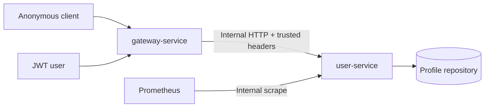

# User Service Documentation

**Version:** 1.0.0  
**Date:** June 15, 2026  
**Status:** Implemented and verified user-service baseline

## Purpose

`user-service` is the internal demonstration service for public user profiles and
authenticated self-service profile access in Sentra.

It proves that the gateway can:

- expose a deliberately limited public resource;
- validate a JWT and `profile:*` scopes before forwarding;
- replace untrusted identity headers with trusted Sentra headers;
- propagate a stable request ID; and
- keep downstream application ports unavailable to external clients.

The service owns profile data and profile update rules. It does not validate
external JWTs, issue tokens, manage gateway routes, enforce gateway rate limits,
or trust a user ID supplied by a client for `/me`.

## Implementation Status

The service is implemented as a Java 25 and Spring Boot 4.0.7 application with a
deterministic in-memory repository, strict trusted-context validation, all three
documented HTTP operations, stable errors, Actuator/Prometheus, springdoc
OpenAPI, Maven wrapper, Podman assets, and a Postman collection.

Executable verification is recorded in `REQUIREMENTS_TRACEABILITY.md`.

## Architecture

The target implementation is a Spring Boot JSON HTTP service on internal port
`8081`. An in-memory repository with deterministic seed data is sufficient for the
demonstration release. A database may replace it only if ownership, migrations,
backup, health, and failure behavior are documented.

## Responsibilities

The service shall:

- return a redacted public profile by ID;
- return the authenticated caller's complete safe profile;
- update only the authenticated caller's mutable profile fields;
- derive `/me` identity exclusively from `X-Sentra-Subject`;
- require trusted gateway context on protected internal routes;
- echo the approved request ID in `X-Request-Id`;
- return the shared structured error shape;
- expose liveness, readiness, Prometheus metrics, and OpenAPI;
- reject unknown JSON fields and unsupported media types;
- enforce body, field, and optimistic-version limits; and
- avoid credentials, secrets, and sensitive profile data in logs and metrics.

The service shall not:

- accept bearer tokens, API keys, or signing credentials as downstream identity;
- authorize a `/me` request from a path, query, or body user ID;
- return email, credentials, internal flags, or security metadata publicly;
- expose mutation or internal endpoints directly to external networks;
- implement gateway route, rate-limit, IP, risk, or signing policy; or
- enable development fault controls in production-like profiles.

## Suggested Packages

| Package | Responsibility |
| --- | --- |
| `config` | Type-safe settings, OpenAPI, profile-specific security |
| `profile` | Profile model, repository, service, and DTO mapping |
| `web` | Internal controllers and request validation |
| `common.error` | Stable error model and exception handling |
| `common.request` | Trusted-header parsing and request correlation |
| `observability` | Low-cardinality metrics and request logging |

Package names are implementation guidance until source code exists.

## Request Lifecycle

For `GET /internal/v1/users/{id}/public`:

1. The request reaches the service only through the internal network.
2. The service validates or adopts `X-Sentra-Request-Id`.
3. The path ID is parsed as a UUID.
4. The profile is loaded.
5. A dedicated public DTO is created from allowlisted fields.
6. The response includes `X-Request-Id`.

For protected `/me` routes:

1. The gateway validates the external JWT and route permission.
2. The gateway removes inbound reserved headers.
3. The gateway forwards trusted subject, actor, scope, route, and request headers.
4. The service verifies the required trusted context is present and well formed.
5. The service requires actor type `USER`.
6. The service resolves the profile by `X-Sentra-Subject`.
7. For updates, the service validates JSON, mutable fields, and `version`.
8. The repository atomically applies the optimistic update.
9. The service returns the safe private representation and `X-Request-Id`.

The service performs defense-in-depth checks on trusted context. Gateway route
authorization remains the primary scope-enforcement point.

## Route Model

| External route | Internal route | Category | Gateway permission |
| --- | --- | --- | --- |
| `GET /api/v1/public/users/{id}` | `GET /internal/v1/users/{id}/public` | `PUBLIC` | None |
| `GET /api/v1/users/me` | `GET /internal/v1/users/me` | `USER` | `profile:read` |
| `PATCH /api/v1/users/me` | `PATCH /internal/v1/users/me` | `USER` | `profile:write` |

The external-to-internal rewrite is gateway configuration. The service exposes
only the internal paths.

Recommended gateway route properties:

| Route | Authentication | Retry | Timeout | Audit |
| --- | --- | --- | --- | --- |
| Public read | None | At most one bounded retry | Finite | Denials and failures |
| Self read | JWT | At most one bounded retry | Finite | Denials and failures |
| Self update | JWT | Disabled | Finite | Mutation and denial |

`PATCH` is not automatically retryable. Optimistic locking prevents lost updates
but is not a substitute for an idempotency contract.

## Profile Model

Minimum internal profile:

| Field | Type | Public | Mutable |
| --- | --- | --- | --- |
| `id` | UUID | Yes | No |
| `subject` | Nonblank opaque string | No | No |
| `displayName` | String, 1-100 characters | Yes | Yes |
| `bio` | String, 0-500 characters | Yes | Yes |
| `avatarUrl` | HTTPS URI or `null` | Yes | Yes |
| `email` | Valid email address | No | Yes |
| `locale` | BCP 47 language tag | No | Yes |
| `timezone` | IANA time-zone ID | No | Yes |
| `status` | `ACTIVE`, `DISABLED`, `DELETED` | No | No |
| `version` | Positive integer | No | Required for update |
| `createdAt` | RFC 3339 instant | No | No |
| `updatedAt` | RFC 3339 instant | No | No |

Public serialization is allowlist-based. Adding a field to the internal model must
not automatically expose it through the public DTO.

`subject` is the stable association to the JWT `sub` claim. It is not necessarily
the same value as the profile UUID.

## Update Semantics

`PATCH /internal/v1/users/me` uses merge-style, field-presence semantics:

- omitted mutable fields remain unchanged;
- explicit `null` is accepted only for `bio` and `avatarUrl`;
- `displayName`, `email`, `locale`, and `timezone` cannot be set to `null`;
- `id`, `subject`, `status`, timestamps, and unknown fields are rejected;
- `version` is mandatory and must equal the current stored version;
- a successful update increments `version` exactly once; and
- a no-op valid patch may return the current representation without incrementing
  the version.

The request must use `Content-Type: application/json`.

## Trusted Headers

The service consumes:

| Header | Public read | `/me` | Rule |
| --- | --- | --- | --- |
| `X-Sentra-Request-Id` | Required in routed deployment | Required | Maximum 128 visible ASCII characters |
| `X-Sentra-Subject` | Optional | Required | Nonblank opaque identity |
| `X-Sentra-Actor-Type` | Optional | Required | Must be `USER` for `/me` |
| `X-Sentra-Tenant-Id` | Optional | Optional | Context only; never trusted from a bypass path |
| `X-Sentra-Roles` | Optional | Optional | Context only |
| `X-Sentra-Scopes` | Optional | Required | Must contain the route's expected scope |
| `X-Sentra-Route-Id` | Required in routed deployment | Required | Must identify an approved route |
| `X-Sentra-Source-Ip` | Optional | Optional | Logging context only; never a metric label |

`X-Sentra-Client-Id` is not a valid identity for user `/me` routes.

Trusted headers are secure only when the service is reachable exclusively from the
gateway or an authenticated workload channel. A production-like deployment shall
combine header validation with network isolation and, when available, workload
identity or mTLS.

## Security Boundaries

- External TLS terminates at the approved edge or gateway.
- The service application port is internal and not published by default.
- Gateway credential headers must not be required or logged downstream.
- A missing, malformed, or contradictory trusted identity denies `/me`.
- A disabled or deleted profile is not returned as an active user profile.
- Public lookup uses a separate DTO and never serializes the internal entity.
- URL fields accept HTTPS only; credentials, fragments, loopback hosts, link-local
  hosts, and obvious metadata endpoints are rejected.
- Logs do not contain authorization headers, cookies, tokens, email addresses,
  profile bodies, or trusted-subject values at normal levels.

## Persistence

The demonstration baseline may use deterministic in-memory data. The repository
contract must support:

- lookup by profile UUID;
- lookup by unique subject;
- atomic update by ID and expected version; and
- deterministic reset for tests.

Required uniqueness:

- profile `id`;
- nonblank `subject`; and
- normalized email address when email uniqueness is enabled.

In-memory state is lost on restart and is not production persistence. If a
database is introduced, it becomes user-service-owned data and must not be placed
in the gateway schema.

## Error Handling

All JSON failures use the contract in `API_CONTRACT.md`. Client messages are
sanitized. Validation details identify fields but do not echo submitted values.

The service preserves the approved request ID in both the response header and
error body. Unexpected exceptions are logged with the request ID and route
template, then returned as `USR_INTERNAL_ERROR`.

## Observability

Required endpoints:

- `/actuator/health/liveness`
- `/actuator/health/readiness`
- `/actuator/prometheus`
- `/actuator/metrics`
- `/v3/api-docs`
- `/swagger-ui.html`

Required observations include HTTP request count/duration, status class, route
template, profile lookup outcome, optimistic-conflict count, JVM/process health,
and repository health when an external store exists.

Metric labels may include method, normalized route template, status class,
operation, result, and environment. They must not include user IDs, subjects,
emails, request IDs, IP addresses, raw paths, or profile values.

## Container Design

The target container shall:

1. build and test reproducibly;
2. copy only the executable artifact into the runtime image;
3. run as a non-root user;
4. use a read-only root filesystem where supported;
5. expose only internal port `8081`;
6. use liveness/readiness health checks; and
7. contain no credentials or environment-specific configuration.

`Containerfile`, `compose.yaml`, and `compose.postman.yaml` implement this design.
The base topology keeps port 8081 internal. The local Postman override adds a
non-internal test network and publishes the port only on host loopback.

## Verification

The minimum automated evidence is:

- public DTO redaction tests;
- subject-to-profile resolution tests;
- spoofed or missing trusted-header denial tests;
- actor-type and scope defense-in-depth tests;
- GET and PATCH controller contract tests;
- unknown-field, media-type, body-size, and field validation tests;
- optimistic update success and conflict tests;
- disabled/deleted profile behavior tests;
- error-shape and request-correlation tests;
- health, Prometheus, and OpenAPI tests;
- gateway-to-user-service contract tests; and
- an end-to-end anonymous, JWT read, JWT update, and denial workflow.

## Current Boundaries

The following are intentionally not claimed:

- durable production profile storage;
- user registration, deletion, password, credential, or MFA management;
- token issuance or JWT validation inside the service;
- administrative profile search or management;
- avatar upload or binary content storage;
- email verification or notification workflows;
- tenant lifecycle management;
- production workload identity or mTLS configuration;
- dashboards, alerts, performance certification, backup, or restore evidence.

JWT validation and external-route behavior remain gateway responsibilities. The
user-service suite verifies the downstream trusted-header contract directly; a
full identity-provider JWT workflow requires the separately deployed gateway and
identity environment.

These capabilities require explicit requirements and implementation evidence.
